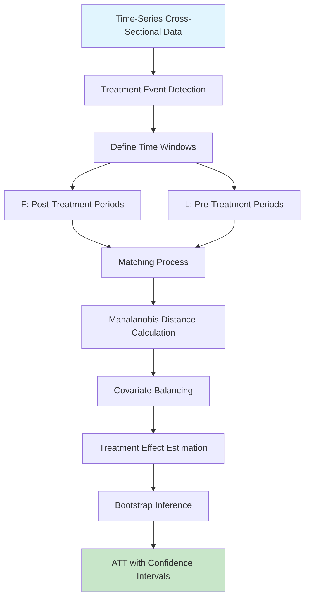
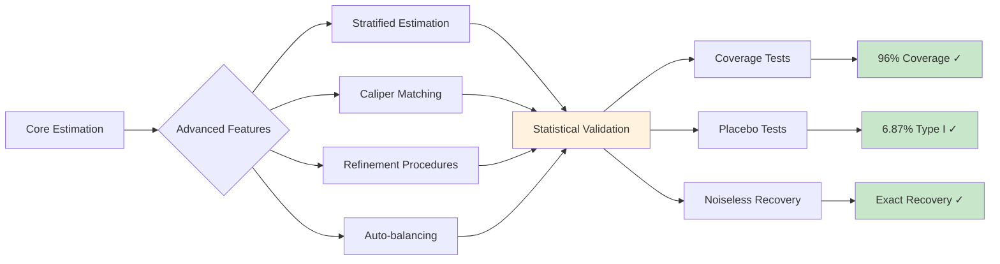
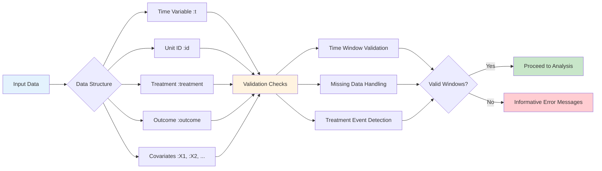
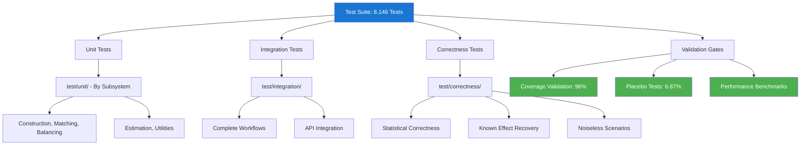

# TSCSMethods.jl Visualization Plan

This document outlines high-level Mermaid diagrams to illustrate the statistical methodology, user workflows, and package design of TSCSMethods.jl.

## 1. Statistical Methodology Flow

### Diagram 1A: Core TSCS Matching Methodology


### Diagram 1B: Advanced Features & Validation


## 2. User Workflow Diagrams

### Diagram 2A: Basic User Workflow
```mermaid
flowchart TD
    A[Load Data] --> B[Create Model with makemodel()]
    B --> C[Specify Time Windows F & L]
    C --> D[Define Covariates & Time-Varying Dict]
    
    D --> E[Match Phase]
    E --> F[match!(model, dat)]
    F --> G[Balance Phase]
    G --> H[balance!(model, dat)]
    H --> I[Estimation Phase]
    I --> J[estimate!(model, dat)]
    
    J --> K[Results]
    K --> L[model.overall.ATT]
    K --> M[Confidence Intervals]
    K --> N[Bootstrap Distributions]
    
    style A fill:#e3f2fd
    style E fill:#fff3e0
    style G fill:#f3e5f5
    style I fill:#e8f5e8
    style K fill:#fff8e1
```

### Diagram 2B: Advanced Workflows
```mermaid
flowchart TD
    A[Basic Workflow Complete] --> B{Advanced Options}
    
    B --> C[Stratified Analysis]
    B --> D[Refinement & Calipers]
    B --> E[Auto-balancing]
    B --> F[Multiple Outcomes]
    
    C --> G[stratify(model)]
    C --> H[CICStratified models]
    
    D --> I[refine(model)]
    D --> J[caliper(model)]
    
    E --> K[autobalance(model)]
    
    F --> L[Vector outcomes in makemodel()]
    
    G --> M[Subgroup Analysis]
    H --> M
    I --> N[Improved Matching]
    J --> N
    K --> O[Optimized Balance]
    L --> P[Simultaneous Estimation]
    
    style B fill:#e1f5fe
    style M fill:#c8e6c9
    style N fill:#c8e6c9
    style O fill:#c8e6c9
    style P fill:#c8e6c9
```

### Diagram 2C: Data Requirements & Validation


## 3. Package Design Architecture

### Diagram 3A: Module Structure & Dependencies
```mermaid
graph TD
    A[TSCSMethods.jl] --> B[core/]
    A --> C[matching/]
    A --> D[balancing/]
    A --> E[estimation/]
    A --> F[advanced/]
    A --> G[utilities/]
    
    B --> B1[types.jl - 37 type definitions]
    B --> B2[construction.jl - makemodel()]
    
    C --> C1[matching_setup.jl]
    C --> C2[distancing.jl - Mahalanobis distances]
    C --> C3[match.jl - Core matching algorithm]
    C --> C4[ranking.jl - Match ranking]
    C --> C5[retrieve_matches*.jl - 3 files]
    
    D --> D1[balancing.jl - Manual balancing]
    D --> D2[autobalancing.jl - P-value optimization]
    D --> D3[meanbalancing.jl]
    D --> D4[fullbalancing.jl - Multiple strategies]
    
    E --> E1[estimation.jl - ATT calculation]
    E --> E2[bootstrapping.jl - Inference]
    E --> E3[overall.jl - Result compilation]
    E --> E4[estimation_stratified.jl]
    
    F --> F1[stratification.jl]
    F --> F2[refine.jl - Match refinement]
    F --> F3[groupindices.jl]
    
    G --> G1[inspection.jl - Diagnostics]
    G --> G2[storage.jl - Save/load]
    G --> G3[example_data.jl]
    
    style A fill:#1976d2,color:#fff
    style B fill:#4fc3f7
    style C fill:#81c784
    style D fill:#ffb74d
    style E fill:#f06292
    style F fill:#ba68c8
    style G fill:#90a4ae
```

### Diagram 3B: Type Hierarchy & Model Flow
```mermaid
classDiagram
    class VeryAbstractCICModel {
        +title: String
        +data_info: Dict
    }
    
    class AbstractCICModel {
        +covariates: Vector{Symbol}
        +timevary: Dict
        +F: UnitRange
        +L: UnitRange
    }
    
    class AbstractCICModelStratified {
        +strata: Dict
    }
    
    class CIC {
        +matches: Vector{TreatmentObservationMatches}
        +overall: Overall
        +iterations: Int
    }
    
    class CICStratified {
        +strata_results: Dict
    }
    
    class CaliperCIC {
        +caliper_constraints: Dict
    }
    
    class RefinedCIC {
        +refinement_history: Vector
    }
    
    VeryAbstractCICModel <|-- AbstractCICModel
    VeryAbstractCICModel <|-- AbstractCICModelStratified
    AbstractCICModel <|-- CIC
    AbstractCICModel <|-- CaliperCIC
    AbstractCICModel <|-- RefinedCIC
    AbstractCICModelStratified <|-- CICStratified
```

### Diagram 3C: Testing & Validation Architecture


## 4. Implementation Plan

### Phase 1: Statistical Methodology Diagrams
1. Create comprehensive methodology flow showing TSCS matching process
2. Include validation framework diagram
3. Show relationship between F/L windows and estimation

### Phase 2: User Workflow Diagrams  
1. Basic workflow from data input to results
2. Advanced features and options
3. Error handling and validation paths

### Phase 3: Package Architecture Diagrams
1. Module dependency graph with 37 files
2. Type hierarchy showing inheritance relationships
3. Testing infrastructure and validation gates

### Phase 4: Integration & Documentation
1. Embed diagrams in main documentation
2. Create interactive examples linking diagrams to code
3. Add to README.md for quick reference

## Diagram Specifications

- **Format**: Mermaid syntax for GitHub compatibility
- **Style**: Consistent color coding by functional area
- **Detail Level**: High-level overview suitable for both technical and non-technical audiences
- **Interactivity**: Link to relevant documentation sections
- **Maintenance**: Update diagrams with major version releases

## Usage Context

These diagrams will be used in:
- Package documentation (docs/src/)
- README.md overview
- Tutorial materials
- Academic presentations
- GitHub release notes
- Developer onboarding materials

The diagrams provide visual understanding of:
1. **Statistical rigor** - Methodology validation and correctness
2. **User experience** - Clear workflow guidance
3. **Technical architecture** - Professional code organization
4. **Quality assurance** - Comprehensive testing approach