# TSCSMethods.jl

[](https://github.com/human-nature-lab/TSCSMethods.jl/actions/workflows/CI.yml)
[](https://github.com/human-nature-lab/TSCSMethods.jl/actions/workflows/Documentation.yml)
[](https://human-nature-lab.github.io/TSCSMethods.jl/)

**Non-parametric generalized difference-in-differences with covariate matching for time-series cross-sectional data**

TSCSMethods.jl v2.0.0 implements the matching methodology developed in Feltham et al. (2023), which extends the framework of Imai et al. (2021) with novel innovations for causal inference in staggered treatment designs. The package provides non-parametric generalized difference-in-differences estimation with covariate matching for panel data, where units receive treatment at different times.

## Key Features

- **Staggered treatments**: Handle units treated at different times
- **Flexible time windows**: Specify pre-treatment matching periods and post-treatment estimation
- **Event studies**: Focus on treatment effects relative to event timing
- **Covariate matching**: Match treated units to similar controls using time-varying covariates  
- **Multiple balancing**: Manual and automatic covariate balancing
- **Advanced features**: Calipers, stratification, refinement, auto-balancing
- **Bootstrap inference**: Weighted block-bootstrap for uncertainty quantification
- **Statistical validation and comprehensive testing**: See documentation and test files.

## Quick Start

```julia
using TSCSMethods

# Load example data
data = example_data()

# Create model for causal inference
model = makemodel(
    data, :day, :fips, :gub, :death_rte,
    [:pop_dens], Dict(:pop_dens => false), 
    5:10,    # F: post-treatment periods  
    -15:-10  # L: pre-treatment periods
)

# Complete workflow
match!(model, data)      # Find matched control units
balance!(model, data)    # Balance covariates  
estimate!(model, data, dobayesfactor=false)  # Estimate treatment effects

# Results
println("ATT: ", model.overall.ATT)
println("95% CI: [", model.overall.p05, ", ", model.overall.p95, "]")
```

### User Workflow

```mermaid
flowchart TD
    A["📥 Load Data<br/>example_data()"] --> B["🏗️ Create Model<br/>makemodel()"]
    B --> C["🔍 match!(model, data)"]
    C --> D["⚖️ balance!(model, data)"]
    D --> E["📊 estimate!(model, data)"]
    E --> F["📈 Results<br/>ATT & Confidence Intervals"]
    
    style A fill:#e3f2fd,stroke:#1565c0,stroke-width:2px
    style F fill:#c8e6c9,stroke:#2e7d32,stroke-width:3px
```



## Installation

TSCSMethods.jl v2.0.0 requires Julia 1.6 or later (tested on 1.6, 1.10, 1.11). Install from the Julia REPL:

```julia
using Pkg
Pkg.add("TSCSMethods")  # Official release
# OR development version:
# Pkg.add("https://github.com/human-nature-lab/TSCSMethods.jl")
```

## Documentation

- [**Visual Guide**](https://human-nature-lab.github.io/TSCSMethods.jl/diagrams/): Interactive diagrams and workflows
- [**Tutorial**](https://human-nature-lab.github.io/TSCSMethods.jl/tutorial/): Step-by-step analysis walkthrough
- [**Methodology**](https://human-nature-lab.github.io/TSCSMethods.jl/methodology/): Statistical methods and assumptions  
- [**API Reference**](https://human-nature-lab.github.io/TSCSMethods.jl/api/): Complete function documentation
- [**Validation**](https://human-nature-lab.github.io/TSCSMethods.jl/validation/): Test suite and statistical validation
- [**Release Notes**](./release_notes.md): v2.0.0 features and breaking changes

## Examples

See the [Jupyter notebook vignette](./vignette/vignette.ipynb) for a complete analysis example with simulated data.

For a high-level summary of validation tests, see [VALIDATION_TESTS.md](./VALIDATION_TESTS.md).

## Method Overview

The package implements the extended matching approach developed in Feltham et al. (2023), building on Imai et al. (2021), for time-series cross-sectional data:

```mermaid
flowchart TD
    A[Time-Series Cross-Sectional Data] --> B[Treatment Event Detection]
    B --> C[Define Time Windows]
    C --> D["F: Post-Treatment Periods<br/>(e.g., 1:10)"]
    C --> E["L: Pre-Treatment Periods<br/>(e.g., -20:-1)"]
    
    D --> F[Matching Process]
    E --> F
    
    F --> G[Mahalanobis Distance Calculation]
    G --> H[Covariate Balancing]
    H --> I[Treatment Effect Estimation]
    I --> J[Bootstrap Inference]
    J --> K["ATT with Confidence Intervals<br/>📊 Final Results"]
    
    style A fill:#e1f5fe,stroke:#01579b,stroke-width:2px
    style K fill:#c8e6c9,stroke:#2e7d32,stroke-width:3px
    style F fill:#fff3e0,stroke:#ef6c00,stroke-width:2px
    style H fill:#f3e5f5,stroke:#7b1fa2,stroke-width:2px
```



This approach addresses key challenges in panel data analysis: selection bias, time-varying confounding, and temporal correlation.

## System Requirements

- **Julia**: 1.10 or later
- **Memory**: 8GB+ recommended (larger for larger datasets)
- **OS**: Windows, macOS, or Linux

The package automatically installs all required dependencies.

## Citation

If you use TSCSMethods.jl in your research, please cite:

```bibtex
@article{feltham_mass_2023,
  title={Mass gatherings for political expression had no discernible association with the local course of the COVID-19 pandemic in the USA in 2020 and 2021},
  author={Feltham, Eric and Forastiere, Laura and Alexander, Marcus and Christakis, Nicholas A},
  journal={Nature Human Behaviour},
  year={2023},
  publisher={Nature Publishing Group}
}

@misc{feltham_tscsmethods_2023,
  title={TSCSMethods.jl: Matching methods for causal inference with time-series cross-sectional data},
  author={Feltham, Eric Martin},
  year={2023},
  url={https://github.com/human-nature-lab/TSCSMethods.jl}
}
```

Please also cite the foundational methodology:

```bibtex
@article{imai_matching_2021,
  title={Matching Methods for Causal Inference with Time-Series Cross-Sectional Data},
  author={Imai, Kosuke and Kim, In Song and Wang, Erik H},
  journal={American Journal of Political Science},
  year={2021},
  publisher={Wiley Online Library}
}
```

## Contributing

Contributions are welcome!

## References

- Imai, K., Kim, I. S., & Wang, E. H. (2021). Matching Methods for Causal Inference with Time-Series Cross-Sectional Data. *American Journal of Political Science*.
- Feltham, E., Forastiere, L., Alexander, M., & Christakis, N. A. (2023). Mass gatherings for political expression had no discernible association with the local course of the COVID-19 pandemic in the USA in 2020 and 2021. *Nature Human Behaviour*.
- Kim, I. S., Ruah, A., Wang, E., & Imai, K. (2020). Insongkim/PanelMatch [R, C]. https://github.com/insongkim/PanelMatch (Original work published 2018)
    
