# TSCSMethods.jl Visual Guide

This page provides comprehensive visual diagrams illustrating the statistical methodology, user workflows, and package architecture of TSCSMethods.jl.

## 1. Statistical Methodology

### Core TSCS Matching Methodology

The following diagram shows the complete flow of the time-series cross-sectional matching methodology:

```mermaid
flowchart TD
    A[Time-Series Cross-Sectional Data] --> B[Treatment Event Detection]
    B --> C[Define Time Windows]
    C --> D["F: Post-Treatment Periods<br/>(e.g., 1:10)"]
    C --> E["L: Pre-Treatment Periods<br/>(e.g., -20:-1)"]
    
    D --> F[Matching Process]
    E --> F
    
    F --> G[Mahalanobis Distance Calculation]
    G --> H[Covariate Balancing]
    H --> I[Treatment Effect Estimation]
    I --> J[Bootstrap Inference]
    J --> K["ATT with Confidence Intervals<br/>📊 Final Results"]
    
    style A fill:#e1f5fe,stroke:#01579b,stroke-width:2px
    style K fill:#c8e6c9,stroke:#2e7d32,stroke-width:3px
    style F fill:#fff3e0,stroke:#ef6c00,stroke-width:2px
    style H fill:#f3e5f5,stroke:#7b1fa2,stroke-width:2px
```

### Statistical Validation Framework

TSCSMethods.jl includes comprehensive validation to ensure statistical correctness:

```mermaid
flowchart LR
    A[Core Estimation] --> B{Advanced Features}
    
    B --> C[Stratified Estimation]
    B --> D[Caliper Matching]
    B --> E[Refinement Procedures]
    B --> F[Auto-balancing]
    
    C --> G[Statistical Validation Framework]
    D --> G
    E --> G
    F --> G
    
    G --> H["Coverage Tests<br/>📈 Null DGP"]
    G --> I["Placebo Tests<br/>🎲 Permutation"]
    G --> J["Noiseless Recovery<br/>🎯 Exact Tests"]
    
    H --> K["✅ 96% Coverage<br/>(Target: 93-97%)"]
    I --> L["✅ 6.87% Type I Error<br/>(Target: 3-7%)"]
    J --> M["✅ Exact Recovery<br/>(1e-3 tolerance)"]
    
    style G fill:#fff3e0,stroke:#ef6c00,stroke-width:2px
    style K fill:#c8e6c9,stroke:#2e7d32,stroke-width:2px
    style L fill:#c8e6c9,stroke:#2e7d32,stroke-width:2px
    style M fill:#c8e6c9,stroke:#2e7d32,stroke-width:2px
```

## 2. User Workflows

### Basic User Workflow

The standard workflow for using TSCSMethods.jl:

```mermaid
flowchart TD
    A["📥 Load Data<br/>example_data()"] --> B["🏗️ Create Model<br/>makemodel()"]
    B --> C["⏰ Specify Time Windows<br/>F: post-treatment<br/>L: pre-treatment"]
    C --> D["📋 Define Covariates<br/>& Time-Varying Dict"]
    
    D --> E["🔍 Matching Phase"]
    E --> F["match!(model, data)"]
    F --> G["⚖️ Balancing Phase"]
    G --> H["balance!(model, data)"]
    H --> I["📊 Estimation Phase"]
    I --> J["estimate!(model, data)"]
    
    J --> K["📈 Results Available"]
    K --> L["model.overall.ATT"]
    K --> M["Confidence Intervals<br/>p05, p95"]
    K --> N["Bootstrap Distributions"]
    
    style A fill:#e3f2fd,stroke:#1565c0,stroke-width:2px
    style E fill:#fff3e0,stroke:#ef6c00,stroke-width:2px
    style G fill:#f3e5f5,stroke:#7b1fa2,stroke-width:2px
    style I fill:#e8f5e8,stroke:#2e7d32,stroke-width:2px
    style K fill:#fff8e1,stroke:#f57f17,stroke-width:3px
```

### Advanced Workflows

Extended capabilities for sophisticated analyses:

```mermaid
flowchart TD
    A["✅ Basic Workflow Complete"] --> B{🚀 Advanced Options}
    
    B --> C["👥 Stratified Analysis"]
    B --> D["🎯 Refinement & Calipers"]
    B --> E["🤖 Auto-balancing"]
    B --> F["📊 Multiple Outcomes"]
    
    C --> G["stratify(model)<br/>Group-specific effects"]
    C --> H["CICStratified models<br/>Heterogeneous treatment"]
    
    D --> I["refine(model)<br/>Iterative improvement"]
    D --> J["caliper(model)<br/>Distance constraints"]
    
    E --> K["autobalance(model)<br/>P-value optimization"]
    
    F --> L["Vector outcomes<br/>Simultaneous estimation"]
    
    G --> M["📈 Subgroup Analysis<br/>Detailed Results"]
    H --> M
    I --> N["🎯 Improved Matching<br/>Better Balance"]
    J --> N
    K --> O["⚖️ Optimized Balance<br/>Statistical Precision"]
    L --> P["📊 Multi-outcome Results<br/>Joint Inference"]
    
    style B fill:#e1f5fe,stroke:#1565c0,stroke-width:2px
    style M fill:#c8e6c9,stroke:#2e7d32,stroke-width:2px
    style N fill:#c8e6c9,stroke:#2e7d32,stroke-width:2px
    style O fill:#c8e6c9,stroke:#2e7d32,stroke-width:2px
    style P fill:#c8e6c9,stroke:#2e7d32,stroke-width:2px
```

### Data Requirements & Validation

Input data structure and validation process:

```mermaid
flowchart LR
    A["📋 Input Data<br/>DataFrame"] --> B{🔍 Data Structure Check}
    
    B --> C["⏰ Time Variable<br/>:day, :t, etc."]
    B --> D["🆔 Unit ID<br/>:fips, :id, etc."]
    B --> E["💊 Treatment<br/>:treatment, :gub"]
    B --> F["📈 Outcome<br/>:outcome, :Y"]
    B --> G["📊 Covariates<br/>:X1, :X2, :pop_dens"]
    
    C --> H["✅ Validation Checks"]
    D --> H
    E --> H
    F --> H
    G --> H
    
    H --> I["⏱️ Time Window Validation<br/>F > 0, L < 0"]
    H --> J["❓ Missing Data Handling<br/>Imputation strategies"]
    H --> K["🎯 Treatment Event Detection<br/>Binary indicators"]
    
    I --> L{All Valid?}
    J --> L
    K --> L
    
    L -->|✅ Yes| M["🚀 Proceed to Analysis<br/>Ready for matching"]
    L -->|❌ No| N["⚠️ Informative Errors<br/>Clear guidance"]
    
    style A fill:#e3f2fd,stroke:#1565c0,stroke-width:2px
    style H fill:#fff3e0,stroke:#ef6c00,stroke-width:2px
    style M fill:#c8e6c9,stroke:#2e7d32,stroke-width:2px
    style N fill:#ffcdd2,stroke:#c62828,stroke-width:2px
```

## 3. Package Architecture

### Module Structure & Dependencies

The clean modular organization of TSCSMethods.jl:

```mermaid
graph TD
    A["🏛️ TSCSMethods.jl<br/>Main Module"] --> B["🔷 core/<br/>2 files"]
    A --> C["🔍 matching/<br/>9 files"]
    A --> D["⚖️ balancing/<br/>7 files"]
    A --> E["📊 estimation/<br/>9 files"]
    A --> F["🚀 advanced/<br/>3 files"]
    A --> G["🛠️ utilities/<br/>7 files"]
    
    B --> B1["📋 types.jl<br/>37 type definitions"]
    B --> B2["🏗️ construction.jl<br/>makemodel() function"]
    
    C --> C1["⚙️ matching_setup.jl"]
    C --> C2["📏 distancing.jl<br/>Mahalanobis distances"]
    C --> C3["🎯 match.jl<br/>Core matching algorithm"]
    C --> C4["📊 ranking.jl<br/>Match ranking system"]
    C --> C5["🔄 retrieve_matches*.jl<br/>3 specialized files"]
    
    D --> D1["⚖️ balancing.jl<br/>Manual balancing"]
    D --> D2["🤖 autobalancing.jl<br/>P-value optimization"]
    D --> D3["📈 meanbalancing.jl<br/>Mean-based strategy"]
    D --> D4["🔄 fullbalancing.jl<br/>Multiple strategies"]
    
    E --> E1["📊 estimation.jl<br/>ATT calculation"]
    E --> E2["🎲 bootstrapping.jl<br/>Statistical inference"]
    E --> E3["📈 overall.jl<br/>Result compilation"]
    E --> E4["👥 estimation_stratified.jl<br/>Group analysis"]
    
    F --> F1["👥 stratification.jl<br/>Subgroup methods"]
    F --> F2["🎯 refine.jl<br/>Match refinement"]
    F --> F3["🔢 groupindices.jl<br/>Index utilities"]
    
    G --> G1["🔍 inspection.jl<br/>Diagnostic tools"]
    G --> G2["💾 storage.jl<br/>Save/load functions"]
    G --> G3["📋 example_data.jl<br/>Sample datasets"]
    
    style A fill:#1976d2,color:#fff,stroke:#0d47a1,stroke-width:3px
    style B fill:#4fc3f7,stroke:#0288d1,stroke-width:2px
    style C fill:#81c784,stroke:#388e3c,stroke-width:2px
    style D fill:#ffb74d,stroke:#f57c00,stroke-width:2px
    style E fill:#f06292,stroke:#c2185b,stroke-width:2px
    style F fill:#ba68c8,stroke:#7b1fa2,stroke-width:2px
    style G fill:#90a4ae,stroke:#546e7a,stroke-width:2px
```

### Type Hierarchy System

Object-oriented design with clear inheritance:

### Testing & Validation Architecture

Comprehensive quality assurance framework:

```mermaid
flowchart TB
    A["🧪 Test Suite<br/>8,146 Total Tests<br/>99.4% Success Rate"] --> B["🔬 Unit Tests"]
    A --> C["🔗 Integration Tests"]  
    A --> D["✅ Correctness Tests"]
    A --> E["🎯 Validation Gates"]
    
    B --> B1["📁 test/unit/<br/>Tests by Subsystem"]
    B1 --> B2["🏗️ Construction & Types<br/>🔍 Matching & Distance<br/>⚖️ Balancing Methods"]
    B1 --> B3["📊 Estimation & Bootstrap<br/>🛠️ Utilities & Storage"]
    
    C --> C1["📁 test/integration/<br/>End-to-End Workflows"]
    C1 --> C2["🔄 Complete Pipelines<br/>Multi-step Processes"]
    C1 --> C3["🔌 API Integration<br/>Function Combinations"]
    
    D --> D1["📁 test/correctness/<br/>Statistical Validation"]
    D1 --> D2["📈 Known Effect Recovery<br/>Controlled Scenarios"]
    D1 --> D3["🎯 Noiseless Tests<br/>Perfect Conditions"]
    D1 --> D4["🌊 Confounded DGPs<br/>Bias Reduction"]
    
    E --> E1["📊 Coverage: 96%<br/>✅ Within [93%, 97%]"]
    E --> E2["🎲 Placebo: 6.87%<br/>✅ Within [3%, 7%]"]
    E --> E3["⚡ Benchmarks<br/>✅ Performance Validated"]
    
    style A fill:#1976d2,color:#fff,stroke:#0d47a1,stroke-width:3px
    style E1 fill:#4caf50,color:#fff,stroke:#2e7d32,stroke-width:2px
    style E2 fill:#4caf50,color:#fff,stroke:#2e7d32,stroke-width:2px
    style E3 fill:#4caf50,color:#fff,stroke:#2e7d32,stroke-width:2px
```

## Summary

These diagrams illustrate TSCSMethods.jl as a comprehensive, professionally-designed package for causal inference:

- **Statistical Rigor**: Validated methodology with comprehensive testing
- **User-Friendly**: Clear workflows from basic to advanced usage  
- **Professional Architecture**: Clean modular design with 37 organized files
- **Quality Assurance**: 8,146 tests with statistical validation gates

The package successfully bridges rigorous statistical methodology with practical usability, making advanced causal inference methods accessible while maintaining the highest standards of statistical correctness.