# Methodology

This page explains the statistical methodology implemented in TSCSMethods.jl.

## Overview

TSCSMethods.jl implements the extended matching approach for time-series cross-sectional (TSCS) data developed in Feltham et al. (2023), which builds upon and extends the framework of Imai et al. (2021). This method addresses key challenges in causal inference with panel data:

1. Selection bias: Units self-select into treatment
2. Time-varying confounding: Confounders change over time
3. Temporal correlation: Outcomes are correlated within units over time

## Methodology Overview

The following diagram illustrates the complete statistical methodology flow implemented in TSCSMethods.jl:

## The Matching Framework

### Problem Setup

Consider panel data with:
- Units: $i = 1, ..., N$ (*e.g.*, counties, countries)
- Time periods: $t = 1, ..., T$
- Treatment: $D_{it} \in \{0, 1\}$ 
- Outcome: $Y_{it}$
- Covariates: $X_{it}$

### Staggered Treatment Design

TSCSMethods.jl handles **staggered adoption** where units receive treatment at different times:
- Unit $i$ receives treatment at time $\tau_i$ (the specific day of the event)
- $D_{it} = 1$ if $t = \tau_i$, $0$ otherwise (treatment occurs only on event day)
- Focus on **event studies**: effects relative to treatment timing
- Supports any discrete events occurring on specific dates

### Matching Algorithm

For each treated unit $i$ at time $\tau_i$:

1. Define matching window: Pre-treatment periods $L = \{l_1, ..., l_L\}$ (negative values)
2. Find similar controls: Units $j$ with similar $X_{j,\tau_i+l}$ for $l \in L$
3. Calculate distances: $d(i,j) = \sum_{l \in L} w_l ||X_{i,\tau_i+l} - X_{j,\tau_i+l}||$
4. Select matches: Closest $K$ control units for each treated unit

### Balancing

Assess matching quality by comparing covariate distributions:

$$\text{Balance}_{l,k} = \frac{1}{n_1} \sum_{i \in \text{Treated}} X_{i,\tau_i+l} - \frac{1}{n_0} \sum_{j \in \text{Controls}} X_{j,\tau_i+l}$$

Good matches have small balance statistics.

### Treatment Effect Estimation

Estimate Average Treatment Effect on Treated (ATT) for post-treatment periods $f \in F$:

$$\hat{\tau}_f = \frac{1}{|\text{Treated}|} \sum_{i \in \text{Treated}} \left[ Y_{i,\tau_i+f} - \frac{1}{|M_i|} \sum_{j \in M_i} Y_{j,\tau_i+f} \right]$$

where $M_i$ is the set of matched controls for unit $i$.

### Crossover Windows and Treatment History

The method incorporates sophisticated treatment history matching:
- Crossover window: Period examined for treatment history of potential matches
- Pre-treatment crossover: Matches must have similar treatment histories before the focal treatment
- Post-treatment crossover: Control units cannot be treated during specified periods after the focal treatment
- This prevents contamination from other events that might confound the estimates

### Bootstrap Inference

Uncertainty quantification via weighted block-bootstrap:

1. Block resampling: Resample entire time series of units to account for within-unit temporal dependence
2. Weighted procedure: Account for units being used as matches multiple times
3. Re-estimation: Calculate ATT for each of 10,000 bootstrap samples
4. Confidence intervals: Derived from 2.5th and 97.5th percentiles of bootstrap distribution
5. Bayes factors: Additional evidence quantification using bootstrap distribution parameters

## Implementation Details

### Time Period Specification

- L periods: Pre-treatment periods for matching (negative values)
  - Example: `L = -10:-1` uses 10 periods before treatment
- F periods: Post-treatment periods for estimation (positive values)  
  - Example: `F = 1:5` estimates effects 1-5 periods after treatment
- Reference period: Usually `-1` (period just before treatment)

### Covariate Handling

- Time-invariant: Unit characteristics that don't change over the study period
  - Demographics, geography, institutional features
  - Any baseline characteristics relevant to the outcome
- Time-varying: Variables that change over time during the matching window
  - Outcome history, behavioral indicators, environmental conditions
  - Any time-series covariates relevant to treatment assignment and outcomes
- Standardization: Covariates standardized using treated unit variance
- Balance assessment: Standardized mean differences maintained ≤ 0.1

### Distance Metrics

Default uses Mahalanobis distance with temporal averaging:

$$d(i,j) = \frac{1}{L} \sum_{l=1}^{L} \sqrt{(V_{i,t-l} - V_{j,t-l})^T \Sigma_{i,t-l}^{-1} (V_{i,t-l} - V_{j,t-l})}$$

where:
- $V_{i,t-l}$ is the vector of covariates for unit $i$ at time $t-l$
- $\Sigma_{i,t-l}$ is the diagonal covariance matrix
- $L = 30$ days is the matching window length
- Distance averaged over the pre-treatment period

## Assumptions

The method relies on several key assumptions:

1. Unconfoundedness: $Y_{it}(0), Y_{it}(1) \perp D_{it} | X_{it}, \text{past}$
2. Common support: Sufficient overlap in covariate distributions
3. No anticipation: Units don't change behavior before treatment
4. SUTVA: No spillover effects between units

## Extensions

TSCSMethods.jl supports several extensions:

- Calipers: Restrict matches to units within distance threshold (balance scores ≤ 0.1)
- Stratification: Separate analysis by subgroups (any categorical or binned continuous variables)
- Multiple outcomes: Analyze several dependent variables simultaneously
- Refinement: Iterative improvement of matches (up to 5 best matches per treated unit)
- Spillover effects: Account for geographic spillover (*e.g.*, rally attendees from neighboring counties)
- Multiple treatments: Handle units with repeated treatments over time

### Spillover Effects Implementation

For events with potential geographic spillover (see Feltham et al. 2023 for a detailed case):

- Direct treatment: County hosts the event
- First degree: Counties adjacent to event location
- Second degree: Counties one step away from event location  
- Third degree: Counties two steps away from event location
- Separate ATT estimation for each exposure level

## References

- Feltham, E., Forastiere, L., Alexander, M., & Christakis, N. A. (2023). Mass gatherings for political expression had no discernible association with the local course of the COVID-19 pandemic in the USA in 2020 and 2021. *Nature Human Behaviour*.
- Imai, K., Kim, I. S., & Wang, E. H. (2021). Matching Methods for Causal Inference with Time-Series Cross-Sectional Data. *American Journal of Political Science*.
- Rosenbaum, P. R., & Rubin, D. B. (1983). The central role of the propensity score in observational studies for causal effects. *Biometrika*, 70(1), 41-55.