# Validation Tests

This page summarizes the validation suite used to assess statistical correctness, calibration, and robustness of TSCSMethods.jl. The design follows standard practice: gate on inference calibration (coverage, Type I), and report point‑estimate error (bias/MAE/MSE) without universal raw‑error cutoffs.

## Validation Framework Overview

TSCSMethods.jl employs a comprehensive validation framework to ensure statistical correctness:

## Validation Test Categories

## Randomized Correctness (Synthetic)
- Files: `test/test_synthetic_known_effects.jl`, `test/simulate_tscs.jl`.
- Goal: Recover known per‑f ATT under a randomized, event‑time DGP with adequate support and SNR.
- Method: Build a model with post window `F` and pre window `L`, run `match!` → `estimate!(; dobayesfactor=false)`, compare ATT to ground truth `delta`.

## Confounded DGP — Bias Reduction
- File: `test/test_confounded_dgp.jl`.
- Goal: Show matching/calipers reduce bias when treatment depends on covariates or pre‑trends.
- Method: Generate confounded data; compare naive event‑time DiD vs TSCSMethods (optionally `autobalance`).

## Coverage (Null DGP)
- Files: `test/test_coverage_type1.jl`, `scripts/sim_bias_coverage.jl`.
- Goal: Empirical 95% CI coverage near nominal under ATT = 0.
- Gate (script): overall coverage ∈ [0.93, 0.97].

## Placebo/Permutation (Real Data)
- File: `scripts/placebo_permutation.jl`.
- Goal: Type I error near 5% on permuted event times in `example_data()`.
- Gate: overall Type I ∈ [0.03, 0.07].

## Seed Sweep (Reporting)
- File: `scripts/seed_sweep.jl`.
- Goal: Track MAE/MxE across seeds for a fixed randomized DGP.
- Output: JSON summary at `test/validation/seed_sweep.json` (report‑only by default).

## How to Run
- Unit tests: `julia --project=. -e 'using Pkg; Pkg.test()'`
- Seed sweep (report): `julia --project=. scripts/seed_sweep.jl --out test/validation/seed_sweep.json`
- Coverage gate: `julia --project=. scripts/sim_bias_coverage.jl --seeds 20 --iterations 400 --out test/validation/bias_coverage.json`
- Placebo gate: `julia --project=. scripts/placebo_permutation.jl --permutations 200 --iterations 100 --out test/validation/placebo.json`

For a repository‑level overview of these tests, see `VALIDATION_TESTS.md` in the project root.
